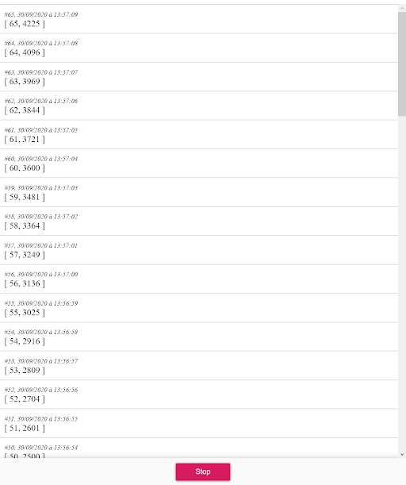

# RxJS Vanilla Player

A visual playground to try RxJS with TypeScript

### Get started

1. If you just downloaded the project, reinstall packages with yarn or npm

`yarn install` or `npm install`

2. Then start a web server and have fun! The web app will be available here: http://localhost:8080/

`yarn start` or `npm start`

3. Create your own observable in the `src/main.ts` file and see what happens.

